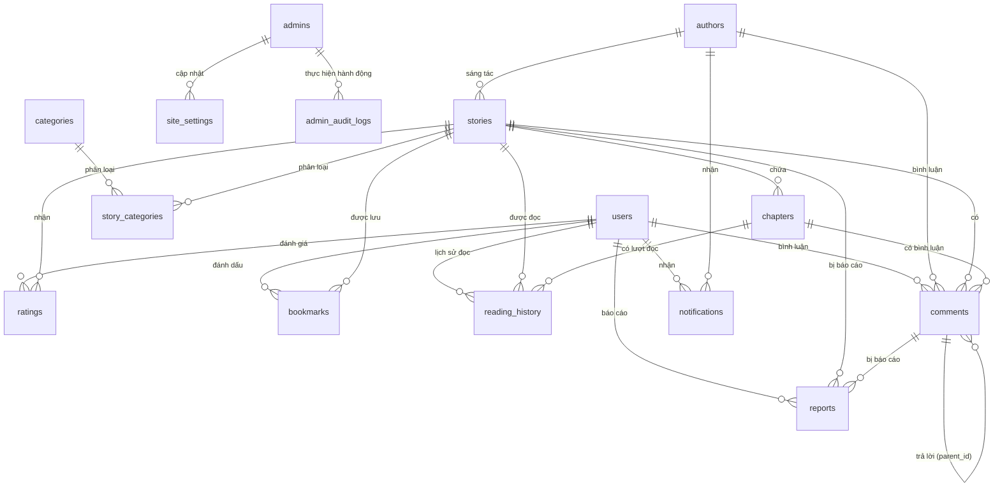
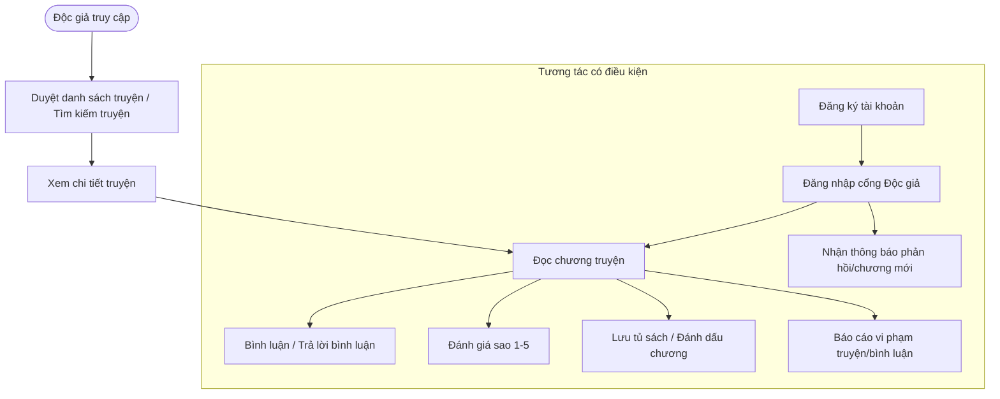
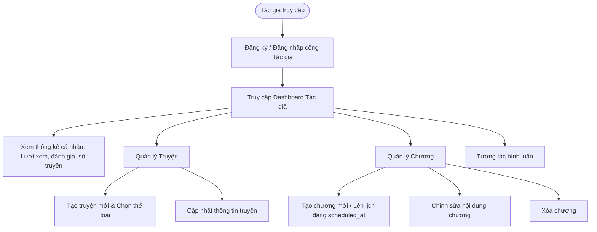
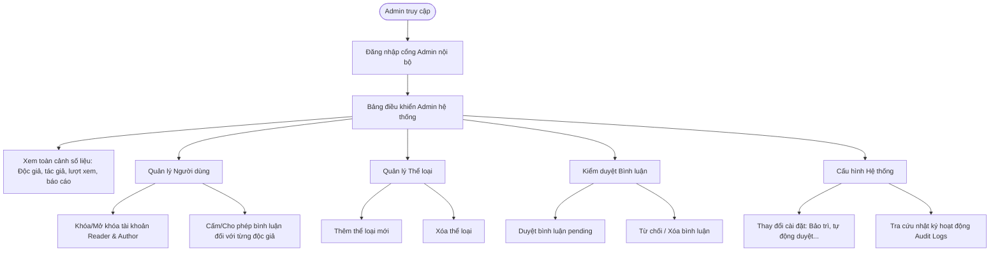

# 🌸 Novel Violet — Nền Tảng Đọc & Chia Sẻ Tiểu Thuyết Trực Tuyến

Chào mừng bạn đến với **Novel Violet** — một hệ thống Web Application hiện đại dành cho độc giả yêu thích tiểu thuyết online và các tác giả tự do mong muốn xuất bản tác phẩm của mình. Dự án được phát triển theo kiến trúc tách biệt rõ ràng giữa **Frontend (Client)** và **Backend (API Server)**, đảm bảo khả năng mở rộng, tối ưu hóa truy vấn dữ liệu hiệu quả cao.

---

## 🛠️ Công Nghệ Sử Dụng (Tech Stack)

### 1. Frontend (Client)
*   **Framework**: [Next.js](https://nextjs.org) (v16.2.x, App Router) & React 19.
*   **Ngôn ngữ**: TypeScript.
*   **Styling**: Vanilla CSS & TailwindCSS (v4) mang lại giao diện mượt mà, hỗ trợ tối ưu hiển thị trên các thiết bị di động (Responsive).
*   **State Management & API Fetching**: React Hooks (`useState`, `useEffect`) kết hợp Fetch API giao tiếp thời gian thực với Backend.

### 2. Backend (API Server)
*   **Runtime Environment**: Node.js (v18+).
*   **Framework**: Express.js (xử lý routing, middleware).
*   **Xác thực & Phân quyền**: [JSON Web Token (JWT)](https://jwt.io) cấp quyền truy cập theo từng vai trò (Role-based Access Control - RBAC).
*   **Bảo mật**: Cơ chế phân tách cổng đăng nhập của Admin, Author và Reader.
    > [!NOTE]
    > Ở phiên bản hiện tại, hệ thống lưu trữ mật khẩu dưới dạng **Plain Text** nhằm đồng bộ đơn giản giữa dữ liệu mẫu (mock data) và tài khoản kiểm thử. Để đưa vào môi trường Production thực tế, hệ thống sẵn sàng tích hợp thư viện `bcrypt` (đã khai báo trong dependencies) để băm (hash) mật khẩu.

### 3. Database (Cơ sở dữ liệu)
*   **Hệ quản trị CSDL**: PostgreSQL.
*   **Quản lý kết nối**: Sử dụng **Connection Pool** (`pg.Pool`) giúp tái sử dụng kết nối tối ưu, giảm thiểu chi phí khởi tạo kết nối mới cho mỗi request, thích hợp với các ứng dụng có tần suất đọc dữ liệu lớn (read-heavy).
*   **Tính năng bổ sung**:
    *   Sử dụng tiện ích mở rộng `uuid-ossp` để tự động sinh mã định danh UUID v4 ngẫu nhiên, nâng cao tính bảo mật và không bị lộ ID tuần tự.
    *   Tích hợp tiện ích mở rộng `pg_trgm` để xây dựng công cụ tìm kiếm mờ (fuzzy search) cho tên tác phẩm, tác giả hoặc độc giả thông qua toán tử `ILIKE` kết hợp với chỉ mục GIN (Generalized Inverted Index).

---

## 📂 Cấu Trúc Thư Mục Dự Án

Dự án được tổ chức theo cấu trúc rõ ràng:

```text
novel-violet/
├── app/                  # --- FRONTEND (Next.js Client) ---
│   ├── admin/            # Trang quản lý nội bộ (Dashboard, truyện, chương, độc giả, thể loại...)
│   ├── auth/             # Trang đăng nhập & đăng ký chung cho Reader và Author
│   ├── components/       # Các thành phần tái sử dụng (Header, StoryCard, StoryGrid, Pagination)
│   ├── profile/          # Trang xem và cập nhật thông tin cá nhân của Reader/Author
│   ├── layout.tsx        # Layout tổng của ứng dụng
│   ├── page.tsx          # Trang chủ ứng dụng (hiển thị danh sách truyện mới/nổi bật cho độc giả)
│   └── types.ts          # Định nghĩa kiểu dữ liệu TypeScript (User, Story, Chapter, v.v.)
│
├── backend/              # --- BACKEND (Express API Server) ---
│   ├── init.sql          # Script khởi tạo cấu trúc bảng CSDL và chèn dữ liệu mẫu (Mock Data)
│   ├── src/
│   │   ├── config/       # Cấu hình hệ thống (kết nối database qua Pool)
│   │   ├── controllers/  # Logic nghiệp vụ xử lý các endpoint API
│   │   ├── middleware/   # Middleware xác thực JWT, phân quyền truy cập, bắt lỗi tập trung
│   │   ├── routes/       # Định nghĩa các tuyến đường API (/auth, /stories, /admin...)
│   │   └── server.js     # Điểm khởi chạy API Server Express, chạy migrations động
│   ├── .env.example      # File mẫu cấu hình biến môi trường Backend
│   └── package.json      # Danh sách dependencies của backend
│
├── package.json          # Danh sách dependencies và script chạy của frontend
└── README.md             # Tài liệu hướng dẫn này
```

---

## 🗄️ Thiết Kế Cơ Sở Dữ Liệu (Database Schema)

CSDL được thiết kế chuẩn hóa với các ràng buộc khóa ngoại chặt chẽ để đảm bảo toàn vẹn dữ liệu. Dưới đây là sơ đồ thực thể chính và mô tả chi tiết:

### Sơ đồ mối quan hệ thực thể (Mermaid ERD)


### Chi tiết các bảng CSDL (Tables)
1.  **`users`**: Lưu trữ thông tin độc giả (Reader). Có trường `is_banned` để khóa tài khoản và `can_comment` để quản lý quyền bình luận.
2.  **`authors`**: Lưu trữ thông tin tác giả. Tác giả là một thực thể độc lập với độc giả, sở hữu tài khoản đăng nhập riêng, có bút danh (`pen_name`), giới thiệu (`bio`), liên kết ủng hộ (`donation_link`) và tổng số lượt xem (`total_views`).
3.  **`admins`**: Lưu trữ tài khoản quản trị viên hệ thống.
4.  **`categories`**: Các thể loại truyện (ví dụ: Tu tiên, Huyền huyễn, Đam mỹ, Đô thị...).
5.  **`stories`**: Thông tin về tác phẩm bao gồm tiêu đề, slug SEO, ảnh bìa, mô tả, trạng thái (`ongoing` - đang viết, `completed` - hoàn thành), điểm đánh giá (`rating`), lượt xem (`view_count`) và tổng số chương (`chapter_count`). Khóa ngoại trỏ đến `authors`.
6.  **`story_categories`**: Bảng trung gian thể hiện quan hệ nhiều-nhiều (Many-to-Many) giữa Truyện và Thể loại (Một truyện có thể thuộc nhiều thể loại).
7.  **`chapters`**: Chi tiết các chương của từng truyện. Có số thứ tự chương (`chapter_number`), tiêu đề chương, nội dung văn bản, số lượng từ (`word_count`), lượt xem riêng của chương (`view_count`), trạng thái phát hành (`is_published`) và thời gian lên lịch đăng bài (`scheduled_at`).
8.  **`comments`**: Bình luận của người dùng. Một bình luận có thể gắn với truyện hoặc cụ thể một chương. Bảng hỗ trợ đa cấp (bình luận con lồng nhau) thông qua liên kết tự phản chiếu `parent_id`. Khóa ràng buộc `chk_comment_owner` đảm bảo người bình luận chỉ có thể là độc giả (`user_id`) HOẶC tác giả (`author_id`).
9.  **`ratings`**: Lưu điểm số đánh giá từ 1 đến 5 sao của độc giả dành cho truyện. Ràng buộc unique trên cặp `(user_id, story_id)` đảm bảo mỗi độc giả chỉ đánh giá một tác phẩm một lần duy nhất.
10. **`bookmarks`**: Tính năng lưu truyện vào tủ sách cá nhân và lưu dấu chương đang đọc dở (`last_read_chapter`).
11. **`reading_history`**: Lưu lịch sử đọc truyện của độc giả kèm theo IP address và User Agent phục vụ việc thống kê lượt xem thực tế và chống spam view.
12. **`reports`**: Báo cáo vi phạm của độc giả nhắm vào một bộ truyện hoặc một bình luận không lành mạnh. Trạng thái báo cáo gồm: `pending`, `resolved`, `rejected`.
13. **`notifications`**: Thông báo gửi tới độc giả hoặc tác giả khi có chương mới, có phản hồi bình luận, kiểm duyệt truyện hoặc thông báo từ hệ thống.
14. **`site_settings`**: Quản lý các cấu hình toàn cục của website (chế độ bảo trì `maintenance_mode`, tự động duyệt bình luận `auto_approve_comments`, độ dài chương tối thiểu `min_chapter_length`, v.v.).
15. **`admin_audit_logs`**: Nhật ký hoạt động của Admin phục vụ công tác giám sát hệ thống (ghi nhận hoạt động khóa tài khoản, duyệt bình luận, thay đổi cấu hình hệ thống).

---

## 🔄 Luồng Nghiệp Vụ Cơ Bản (Business Workflows)

Hệ thống hoạt động xoay quanh 3 đối tượng người dùng chính với các đặc quyền và luồng nghiệp vụ riêng biệt:

### 1. Luồng Nghiệp Vụ của Độc Giả (Reader Workflow)

*   **Duyệt & Đọc truyện**: Độc giả có thể đọc các tác phẩm công khai tại trang chủ mà không bắt buộc đăng nhập (nếu cài đặt `allow_guest_reading` bật). Khi bấm đọc chương, hệ thống tự động lưu lại lịch sử đọc (`reading_history`).
*   **Đăng ký & Đăng nhập**: Đăng ký tài khoản bằng email duy nhất. Sau khi đăng nhập thành công, độc giả nhận token JWT để thực hiện các thao tác cá nhân hóa.
*   **Tương tác tác phẩm**: Độc giả có thể lưu truyện yêu thích (Bookmark), cho điểm đánh giá (Rating) từ 1 đến 5 sao (hệ thống tự động tính toán lại điểm trung bình cộng `rating` trong bảng `stories`), viết bình luận phản hồi dưới truyện hoặc dưới từng chương.
*   **Báo cáo vi phạm**: Gửi báo cáo kèm lý do đối với các truyện có nội dung không phù hợp hoặc bình luận mang tính chất công kích.

### 2. Luồng Nghiệp Vụ của Tác Giả (Author Workflow)

*   **Quản lý tài khoản độc lập**: Đăng ký và quản lý hồ sơ tác giả (Bút danh, bio, link donation). Tài khoản tác giả tách biệt hoàn toàn với tài khoản độc giả và admin.
*   **Dashboard Thống kê**: Xem tổng số truyện đã đăng, tổng lượt xem tích lũy từ tất cả tác phẩm, điểm đánh giá trung bình của độc giả, và danh sách bình luận mới nhất của độc giả gửi đến truyện của mình.
*   **Quản lý tác phẩm**:
    *   Tự tạo truyện mới (hệ thống tự động chuyển đổi tiêu đề tiếng Việt có dấu thành chuỗi URL thân thiện SEO - Slug, nếu bị trùng lặp slug sẽ tự sinh hậu tố ngẫu nhiên để tránh lỗi khóa duy nhất).
    *   Gắn nhiều thể loại cho truyện cùng lúc (Many-to-Many).
*   **Quản lý chương**:
    *   Thêm chương truyện mới, nhập nội dung, hệ thống tự động đếm số từ (`word_count`).
    *   Hỗ trợ tính năng lên lịch phát hành chương (`scheduled_at`). Chỉ khi đến thời gian định trước hoặc chọn xuất bản ngay (`is_published = true`), chương mới hiển thị cho độc giả.
*   **Tương tác**: Trả lời bình luận của độc giả ngay tại trang quản lý truyện của mình.

### 3. Luồng Nghiệp Vụ của Quản Trị Viên (Admin Workflow)

*   **Giám sát toàn hệ thống**: Theo dõi biểu đồ phân bố thể loại truyện, thống kê tăng trưởng tài khoản độc giả/tác giả, số lượng báo cáo vi phạm cần xử lý.
*   **Quản lý người dùng**: Tra cứu danh sách độc giả và tác giả. Có quyền khóa tài khoản (`is_banned = true`) kèm lý do khóa đối với các tài khoản vi phạm, hoặc cấm quyền bình luận (`can_comment = false`) của độc giả.
*   **Quản lý thể loại**: Thêm mới các thể loại truyện hoặc xóa bỏ thể loại không cần thiết.
*   **Kiểm duyệt nội dung**:
    *   Duyệt hoặc từ chối các bình luận của độc giả trước khi hiển thị ra bên ngoài (nếu chế độ cấu hình hệ thống `auto_approve_comments` được cài đặt ở trạng thái tắt - `false`).
    *   Xóa bình luận vi phạm bản quyền hoặc thuần phong mỹ tục.
*   **Cấu hình hệ thống**: Thay đổi thông tin hiển thị website, bật/tắt chế độ bảo trì, thay đổi quy định độ dài chương tối thiểu hoặc thiết lập thời gian hết hạn đăng nhập.
*   **Truy vết hệ thống (Audit Logs)**: Mọi thao tác quan trọng của Admin (khóa user, duyệt bình luận, đổi cấu hình) đều được tự động ghi lại vào bảng `admin_audit_logs` để kiểm tra khi xảy ra sự cố.

---

## ⛓️ Luồng Hệ Thống & Luồng Dữ Liệu Kỹ Thuật (System & Data Flow)

### 1. Luồng Xác Thực và Phân Quyền (Authentication & Authorization Flow)
Hệ thống sử dụng JWT lưu ở LocalStorage của Client để xác thực các yêu cầu API.
```text
[Client App] ---> (1) Gửi POST /api/auth/login (Email, Mật khẩu, Vai trò) ---> [API Server]
[Client App] <--- (2) Trả về dữ liệu User + Token JWT (Ký bằng SECRET) <--- [API Server]
     |
(Lưu Token vào localStorage)
     |
[Client App] ---> (3) Gửi Request kèm Header {"Authorization": "Bearer <token>"} ---> [Middleware verifyToken]
                                                                                           |
                                                                                    (Giải mã JWT)
                                                                                           |
                                                                             [Middleware checkRole (Admin/Author)]
                                                                                           |
                                                                                     (Thành công)
                                                                                           v
[Client App] <--- (4) Trả kết quả dữ liệu được phân quyền truy cập <--- [Controller Logic]
```

### 2. Luồng Tăng Lượt Xem Bất Đồng Bộ (Asynchronous View Count Update)
Nhằm mang lại trải nghiệm nhanh nhất cho độc giả, luồng cập nhật lượt xem khi truy cập một bộ truyện được thực hiện bất đồng bộ (**Fire-and-forget**):
1.  Độc giả bấm vào chi tiết truyện -> Client gửi yêu cầu `GET /api/stories/:slug` lên Backend.
2.  Backend truy vấn CSDL lấy đầy đủ thông tin truyện và thông tin tác giả.
3.  Backend **trả ngay lập tức** kết quả chi tiết truyện về cho Client hiển thị lên màn hình.
4.  Ngay sau đó, Backend khởi chạy một luồng cập nhật ngầm `UPDATE stories SET view_count = view_count + 1 WHERE id = $1` **mà không cần đợi truy vấn này hoàn thành mới phản hồi về client**. Việc này giúp giảm đáng kể thời gian chờ đợi (Latency) của người dùng.

### 3. Luồng Gắn Thể Loại Tối Ưu (Many-to-Many Categories Batch Insertion)
Khi tác giả tạo hoặc chỉnh sửa truyện và chọn nhiều thể loại, thay vì chạy vòng lặp thực hiện nhiều câu lệnh chèn cơ sở dữ liệu liên tục gây nghẽn đường truyền kết nối:
1.  Dữ liệu mảng thể loại dạng `categoryIds` (mảng các UUID) được gửi lên Server.
2.  Server tận dụng khả năng xử lý mảng cực mạnh của PostgreSQL bằng cách sử dụng hàm `UNNEST`:
    ```sql
    INSERT INTO story_categories (story_id, category_id)
    SELECT $1::uuid, UNNEST($2::uuid[])
    ```
3.  Toàn bộ các bản ghi thể loại được chèn vào bảng trung gian chỉ trong **một câu truy vấn duy nhất**, giúp tăng tối đa hiệu năng hệ thống.
4.  Quá trình này được đặt trong một **Transaction** (`BEGIN` - `COMMIT`), nếu có bất kỳ thể loại nào bị lỗi hoặc không tồn tại, toàn bộ tiến trình sẽ được khôi phục trạng thái ban đầu (`ROLLBACK`), đảm bảo tính toàn vẹn dữ liệu.

### 4. Luồng Bình Luận Đa Cấp (Hierarchical Comment Rendering)
Bình luận hỗ trợ chức năng trả lời lồng ghép nhiều cấp:
*   Mỗi bản ghi trong bảng `comments` lưu trữ cột `parent_id` (trỏ đến chính khóa chính `id` của bảng bình luận đó).
*   Khi truy vấn danh sách bình luận của truyện hoặc chương, hệ thống lấy ra toàn bộ danh sách phẳng rồi thực hiện cấu trúc lại thành cấu trúc cây (Tree) ở Client hoặc Backend để hiển thị phân cấp (Ví dụ bình luận con thụt lề so với bình luận cha).
*   Khi xóa một bình luận cha, nhờ ràng buộc `ON DELETE CASCADE` của khóa ngoại `fk_comments_parent`, toàn bộ các bình luận con trả lời phía dưới tự động bị xóa theo, tránh để lại các bản ghi rác không có nút cha trong cơ sở dữ liệu.

---

## 🚀 Hướng Dẫn Cấu Hình & Chạy Dự Án (Installation & Setup)

### Bước 1: Chuẩn bị Cơ sở dữ liệu (PostgreSQL)
1.  Đảm bảo PostgreSQL đang chạy trên máy của bạn.
2.  Tạo một cơ sở dữ liệu mới tên là `Violet_db`.
3.  Import cấu trúc bảng và dữ liệu mẫu bằng cách chạy file SQL `backend/init.sql`. Bạn có thể sử dụng pgAdmin, DBeaver hoặc chạy lệnh qua CLI:
    ```bash
    psql -U postgres -d Violet_db -f backend/init.sql
    ```

### Bước 2: Cấu hình biến môi trường
1.  **Backend**:
    *   Vào thư mục `backend/`, sao chép file `.env.example` thành `.env`:
        ```bash
        cp backend/.env.example backend/.env
        ```
    *   Mở file `backend/.env` và điền chính xác thông tin kết nối PostgreSQL của bạn (`DB_USER`, `DB_PASSWORD`, `DB_HOST`, `DB_PORT`, `DB_NAME`, và cấu hình `JWT_SECRET`).
2.  **Frontend**:
    *   Tạo file `.env.local` ở thư mục gốc của dự án (nếu chưa có).
    *   Điền địa chỉ API của Backend:
        ```env
        NEXT_PUBLIC_API_URL=http://localhost:5000
        ```

### Bước 3: Cài đặt Dependencies & Khởi chạy dự án

Bạn cần khởi chạy đồng thời cả API Server (Backend) và Client App (Frontend).

#### 🟢 Khởi chạy Backend (API Server):
1.  Mở terminal mới và di chuyển vào thư mục backend:
    ```bash
    cd backend
    ```
2.  Cài đặt các gói thư viện:
    ```bash
    npm install
    ```
3.  Chạy server ở chế độ phát triển (Development mode, hỗ trợ tự động reload khi sửa file):
    ```bash
    npm run dev
    ```
    *Server API mặc định chạy tại địa chỉ: `http://localhost:5000`*

#### 🔵 Khởi chạy Frontend (Next.js Client):
1.  Mở một terminal khác và di chuyển đến thư mục gốc của dự án:
    ```bash
    cd ..   # Trở về thư mục gốc nếu đang ở backend
    ```
2.  Cài đặt các gói thư viện:
    ```bash
    npm install
    ```
3.  Chạy ứng dụng Next.js ở chế độ phát triển:
    ```bash
    npm run dev
    ```
    *Ứng dụng client mặc định hoạt động tại địa chỉ: `http://localhost:3000`*

---

## 👥 Tài Khoản Thử Nghiệm Mặc Định (Test Accounts)

Sau khi chạy lệnh `backend/init.sql`, cơ sở dữ liệu sẽ có sẵn một số tài khoản mẫu sau để bạn kiểm thử các luồng nghiệp vụ của hệ thống:

| Vai trò (Role) | Email | Mật khẩu (Plain text) | Chức năng kiểm thử |
| :--- | :--- | :--- | :--- |
| **Admin** | `admin@novelviolet.com` | `123456` | Kiểm duyệt bình luận, quản lý người dùng, thay đổi thiết lập hệ thống |
| **Author** | `tieuding@gmail.com` | `123456` | Bút danh *Tiêu Đỉnh*. Quản lý truyện *Tru Tiên Kiếp*, viết chương truyện mới, trả lời độc giả |
| **Author** | `tieuho@gmail.com` | `123456` | Bút danh *Ngã Ăn Tây Hồng Thị*. Quản lý truyện *Bàn Long*, *Tinh Không Biến Thể* |
| **Reader** | `reader_a@gmail.com` | `123456` | Tên *Nguyễn Văn A*. Đọc truyện, đánh giá, lưu tủ sách, bình luận |
| **Reader** | `reader_b@gmail.com` | `123456` | Tên *Trần Thị B*. Đọc truyện, bình luận |
